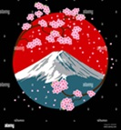

# Sakura Trails - Japan Travel Website  

  

## Overview  
**Sakura Trails** is a responsive travel website showcasing Japan's cultural highlights, cuisine, and top destinations. Designed for anime and travel enthusiasts, it features interactive elements like falling sakura blossoms and a mobile-friendly menu.  

## Features  
- **Responsive Design**: Adapts to desktop and mobile screens.  
- **Interactive Elements**:  
  - Falling sakura blossoms animation.  
  - Toggle menu for mobile users.  
- **Sections**:  
  - Homepage with hero banner.  
  - Culture, cuisine, and travel destination cards.  
  - Trip-planning contact form.  
- **Validated**: Includes a plagiarism declaration page.  

## Technologies  
- HTML5, CSS3, JavaScript  
- No external frameworks (pure vanilla JS/CSS).  

## File Structure  
Stylesheet/
└── stylesheet.css
Images/
└── sakura.jpg, cyber.jpg, kyoto.jpg, japanese-noodles.jpg
JavaScript/
└── script.js
Plagiarism declaration.html
home.html, culture.html, food.html, places.html, contact.html

**Tags**: #FrontEnd #ResponsiveDesign #JavaScript #TravelWebsite  

